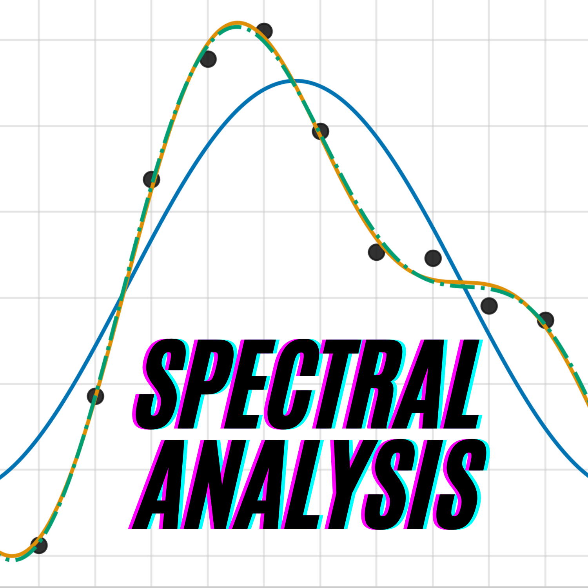

# Spectral Analysis for Geophysical Data Cookbook



[](https://github.com/ProjectPythia/spectral-analysis-cookbook/actions/workflows/nightly-build.yaml)
[](https://binder.projectpythia.org/v2/gh/ProjectPythia/spectral-analysis-cookbook/main?labpath=notebooks)
[](https://zenodo.org/badge/latestdoi/475509405)

This Project Pythia Cookbook covers **spectral analysis methods for geophysical data in Python**, with a focus on Fourier and harmonic analysis, spectral filtering, and Empirical Orthogonal Function (EOF) analysis. The notebooks build foundational skills for analyzing climate time series and gridded datasets, then apply these techniques to real atmospheric observations. Applications include **frequency decomposition** of wind fields, **time-extended EOF (EEOF)** analysis of outgoing longwave radiation (OLR), and **regression of atmospheric fields onto the Real-time Multivariate MJO (RMM) indices** to diagnose the large-scale circulation patterns associated with the Madden–Julian Oscillation (MJO).

## Motivation

Many important climate signals, from the seasonal cycle to the interannual and long term variability, are best understood in **frequency space**. This cookbook teaches you how to move from raw geophysical time series to meaningful diagnostics: removing the annual cycle with harmonic regression, designing and applying spectral filters, interpreting power spectra (including artifacts like the Gibbs phenomenon), and extracting dominant patterns with EOF/PCA.

By the end, you will be able to preprocess climate data for variability studies, decompose fields by frequency band, and carry out EOF analyses on 2D and 3D datasets—including extended (lag-augmented) EOFs useful for propagating signals. These skills form a practical foundation for reproducing standard indices such as the Real-time Multivariate MJO (RMM) index of @wheeler2004all.

## Authors

Juan Diego Mantilla, Sreedevi Puthiyamadam Vasu, Robert R. Ford, Suyue Li, Alex Blackmer, Yiqun Tian, Arman Oliazadeh

### Contributors

<a href="https://github.com/ProjectPythia/spectral-analysis-cookbook/graphs/contributors">
  
</a>

## Structure

### Data Analysis Methods

The foundational content introduces the core tools used throughout the cookbook:

- **Harmonic analysis** of the seasonal cycle on SST climatologies
- **Harmonic regression** to compute anomalies by removing annual-cycle harmonics from daily OLR
- **Fourier analysis** to decompose geophysical time series into their frequency components, identify dominant timescales of variability, and reconstruct signals through spectral filtering.
- **The Gibbs phenomenon** as a primer on spectral leakage when approximating discontinuous signals
- **2D and 3D EOF/PCA** workflows, including the choice between temporal (`XXᵀ`) and spatial (`XᵀX`) covariance matrices

Together, these notebooks establish the preprocessing and decomposition methods needed for spectral analysis of atmospheric and oceanic data.

### Data Analysis Applications

Example workflows apply the methods to real geophysical datasets:

- **Frequency decomposition of zonal winds** at 850 hPa using the FFT to partition tropical atmospheric variability into interannual, annual, semiannual, and intraseasonal bands.
- **Time-extended EOF (EEOF) analysis** of tropical OLR anomalies to extract propagating patterns that standard EOF analysis often splits across mode pairs.
- **Regression of atmospheric fields onto climate indices and principal component time series** to diagnose the spatial patterns associated with dominant modes of variability identified through EOF analysis. A key example is the regression of atmospheric fields onto the Real-time Multivariate MJO (RMM) indices, which reveals the large-scale circulation and convection patterns linked to different phases of the Madden–Julian Oscillation.
- **Machine learning application** Comparison of neural networks trained using raw anomalies versus filtered intraseasonal (~20-100 days) anomalies to forecast 850-hPa zonal wind at subseasonal (~14 days) lead times for a specific location (Nairobi, Kenya). There are future plans to develop additional ML models for temperature and precipitation, and will compare predictive skill with RMM based models.

## Running the Notebooks

You can either run the notebooks in the Cookbook using [Binder](https://binder.projectpythia.org/) or on your local machine.

### Running on Binder

The simplest way to interact with a Jupyter Notebook is through
[Binder](https://binder.projectpythia.org/), which enables "one click"
execution in the cloud. Simply navigate your mouse to
the top right corner of the book chapter you are viewing and click
on the rocket ship icon (see screenshots [here](https://foundations.projectpythia.org/preamble/how-to-use/#running-pythia-foundations-examples)),
and a text box will appear. Type or paste the Pythia Binder link
(`https://binder.projectpythia.org`) and click "Launch".
After a few moments you should be presented with a
notebook that you can interact with. You’ll be able to execute code
and even change the example programs. At first the code cells
have no output, until you execute them by pressing
{kbd}`Shift`{kbd}`Enter`. Complete details on how to interact with
a live Jupyter notebook are described in the Pythia Foundations chapter [Getting Started with
Jupyter](https://foundations.projectpythia.org/foundations/getting-started-jupyter).

Note, not all Cookbook chapters are executable. If you do not see
the rocket ship icon, such as on this page, you are not viewing an
executable book chapter.

### Running on Your Own Machine

If you are interested in running this material locally on your computer, you will need to follow this workflow:

(Replace "cookbook-example" with the title of your cookbooks)

1. Clone the `https://github.com/ProjectPythia/spectral-analysis-coobook` repository:
  ```bash
    git clone https://github.com/ProjectPythia/spectral-analysis-coobook.git
  ```
2. Move into the `spectral-analysis-coobook` directory
  ```bash
   cd spectral-analysis-coobook
  ```
3. Create and activate your conda environment from the `environment.yml` file
  ```bash
   conda env create -f environment.yml
   conda activate spectral-cookbook-dev
  ```
4. Move into the `notebooks` directory and start up Jupyterlab
  ```bash
   cd notebooks/
   jupyter lab
  ```

